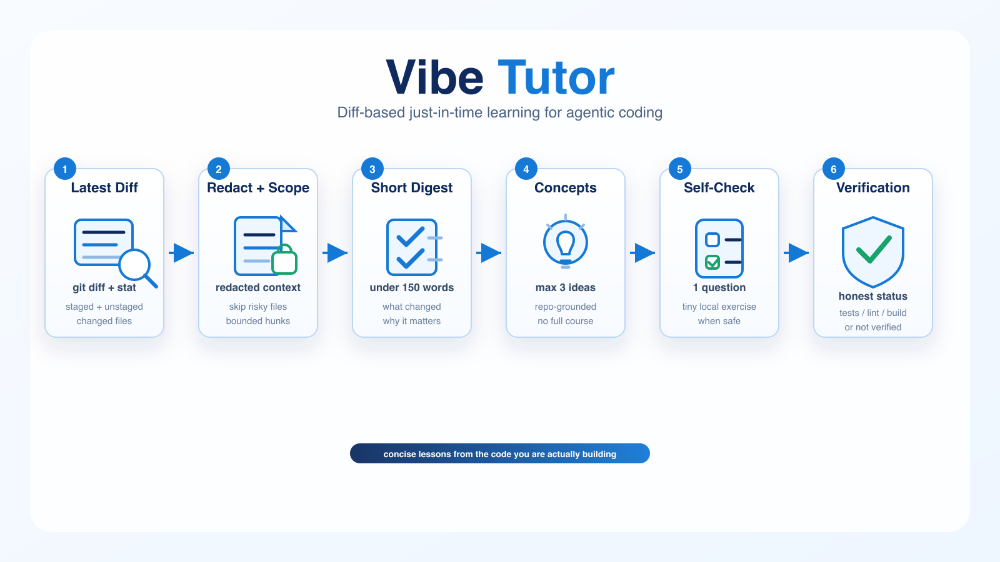

# Vibe Tutor



Vibe Tutor is a Codex plugin and skill for concise, diff-based tutoring from the actual code changes Codex just made.

It is not a long tutorial generator and does not claim that users can become software engineers without learning to code. Its narrower claim is: agentic coding can be paired with concise, diff-based, just-in-time tutoring so beginners can gradually understand the code they are building.

## Why It Exists

Agentic coding can move faster than a beginner can follow. Vibe Tutor slows down only the learning surface, not the coding workflow. It reads the latest staged and unstaged git changes, points to the files that changed, explains at most three concepts, and asks one concrete self-check question.

It teaches from the actual diff in front of the user. It does not generate generic courses, write full codebase documentation, or claim unverified correctness.

## Install

```bash
codex plugin marketplace add bcokdilli/vibe-tutor
codex plugin add vibe-tutor@vibe-tutor
```

Start a new Codex thread after installing so the skill metadata is picked up.

For local development from a clone:

```bash
codex plugin marketplace add .
codex plugin add vibe-tutor@vibe-tutor
```

## Usage

```text
@vibe-tutor summary
@vibe-tutor quiz
@vibe-tutor why src/path/file.ts
@vibe-tutor next
@vibe-tutor expand
```

## Modes

| Mode | Purpose |
| --- | --- |
| `summary` | Produce the default short digest from the latest diff. |
| `quiz` | Generate three questions from the latest diff. |
| `why <file or symbol>` | Explain one changed file, function, class, route, or symbol. |
| `next` | Suggest the next tiny concept to learn from the latest diff. |
| `expand` | Explain one concept more deeply while staying anchored to the repo. |

## Example Output

```markdown
## What changed?
- `plugins/vibe-tutor/skills/vibe-tutor/SKILL.md` now tells Codex to teach from the current git diff.

## Why it matters?
- The lesson stays tied to real code the user is building instead of becoming a generic tutorial.

## Concepts to learn
1. Git diff: the set of changed lines since the last committed version.
2. Trigger scope: rules that decide when a skill should or should not activate.

## Where to look in the code?
- `plugins/vibe-tutor/skills/vibe-tutor/SKILL.md`

## Self-check
- Why should this skill avoid explaining the whole codebase?

## Verification status
- This change was not verified with test/lint/build.
```

## Privacy And Safety Model

- `collect_diff_context.py` uses only Python standard library and local `git` commands.
- It redacts common secret-looking values and skips risky filenames such as `.env`, `.pem`, `.key`, `id_rsa`, `secrets`, `credentials`, and `token`.
- It is not a full secret scanner. Do not paste or commit secrets.
- Vibe Tutor does not store learning state unless the user explicitly asks. If enabled, the optional state file is `.vibe-tutor/learning_state.json` and is gitignored.

## Verification Limits

Vibe Tutor must not claim an implementation is correct unless tests, lint, build, or another deterministic check passed. If no check is known, the digest must say the change was not verified with test/lint/build.

## Repository Layout

```text
.agents/plugins/marketplace.json
plugins/vibe-tutor/
  .codex-plugin/plugin.json
  skills/vibe-tutor/
    SKILL.md
    agents/openai.yaml
    references/
    scripts/
```

## Validation

```bash
make check
```

`make check` runs dependency-free JSON, Python syntax, unit-test, sample digest, diff-context, metadata, and secret-pattern checks.

## Troubleshooting

- If `@vibe-tutor` is not recognized, start a new Codex thread after installing.
- If the digest says there is no current change, make or stage a code change and run it again.
- If a repository has only untracked files, Vibe Tutor can name them, but full diff hunks appear after files are tracked or staged.

## Plugin Details

See `plugins/vibe-tutor/README.md` for plugin-local development notes.

## Contributing

Keep the skill small. Put longer rubrics or schemas under `references/`, keep scripts dependency-free unless the repository already has suitable dependencies, and do not broaden the product into generic course generation.

## License

MIT. See `LICENSE`.
